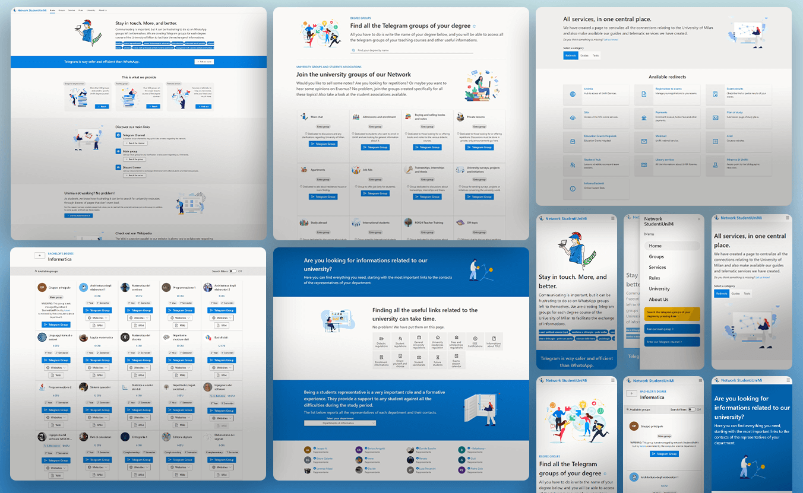

# [studentiunimi.it](https://studentiunimi.it/)
[](https://lbesson.mit-license.org/) 
[](https://GitHub.com/StudentiUniMi/website/graphs/contributors/)
[](https://github.com/StudentiUniMi/website/issues/)
[](https://t.me/studenti_unimi) 
[](https://it.reactjs.org/) 
[](https://www.typescriptlang.org/) 

[studentiunimi.it](https://studentiunimi.it/) is a fully responsive website built with React, [NextJS](https://nextjs.org/) and [Fluent UI](https://developer.microsoft.com/en-us/fluentui#/), with the aim of providing services and access to all groups of didactic courses and general purposes to students of the [University of Milan](https://www.unimi.it/). This website displays data and interacts with a database thanks to the APIs made available by the [backend](https://github.com/StudentiUniMi/backend).



# Run the project locally
1. Create a `.env.local` file in the root of the project:

   ```sh
   NEXT_PUBLIC_API_URL="http://localhost:8010/proxy"
   ```
   
2. Run the development server:

   ```sh
   npm run dev
   ```
   
The web application will be running at http://localhost:3000

# Features ✨
## Dark Theme 🌚
What world would it be without a dark mode?


## Localization 🌍
Localization is crucial for a website that can be used by international students; we make it available without further page loads.


## Color Themes 🍭
Infinite possibilities for multi-color palette usage.


## SEO ⚡
Thanks to NextJS we can improve the visibility of our website with Search engine optimization.

## Contributors
<a href="https://github.com/StudentiUniMi/website/graphs/contributors">
  
</a>