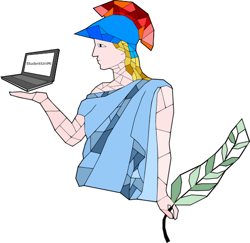

# [Network Studenti UniMi](https://github.com/StudentiUnimi)
Network nato con lo scopo di creare un punto centrale di collegamento tra tutti i corsi di laurea dell'università degli studi di Milano. 
Sono disponibili siti web, gruppi telegram e faq dei corsi didattici dei corsi di laurea triennali di:
- [Informatica](https://studentiunimi.it/#/courses/triennale_informatica/);
- [Informatica musicale](https://studentiunimi.it/#/courses/triennale_informatica_musicale/);
- [Informatica per la comunicazione digitale](https://studentiunimi.it/#/courses/triennale_informatica_com_digitale/);
- [Sicurezza dei sistemi e delle reti informatiche](https://studentiunimi.it/#/courses/triennale_sicurezza_sistemi_reti_informatiche/);
- [Sicurezza dei sistemi e delle reti informatiche online](https://studentiunimi.it/#/courses/triennale_sicurezza_sistemi_reti_informatiche_online/);
  
e dei corsi di laurea magistrali di:
- [Informatica](https://studentiunimi.it/#/courses/magistrale_informatica/);
- [Sicurezza informatica](https://studentiunimi.it/#/courses/magistrale_sicurezza_informatica/).

## Altre informazioni
🛫 [Canale telegram](https://t.me/studenti_unimi)
 
Per qualsiasi dubbio o proposta è possibile contattare il creatore del network [@Giuseppetm](https://t.me/giuseppetm).